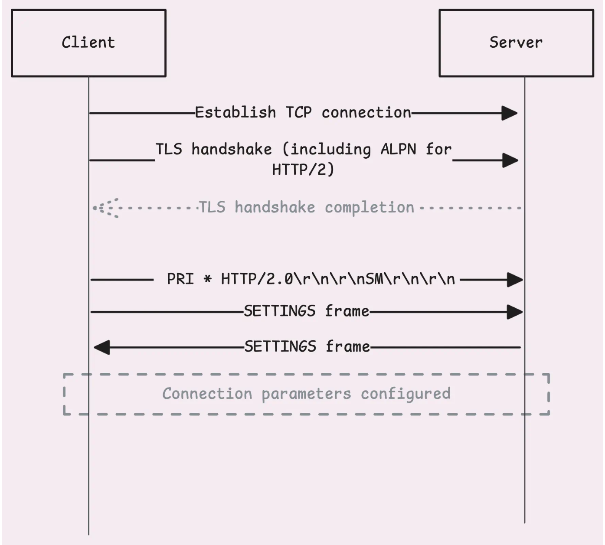
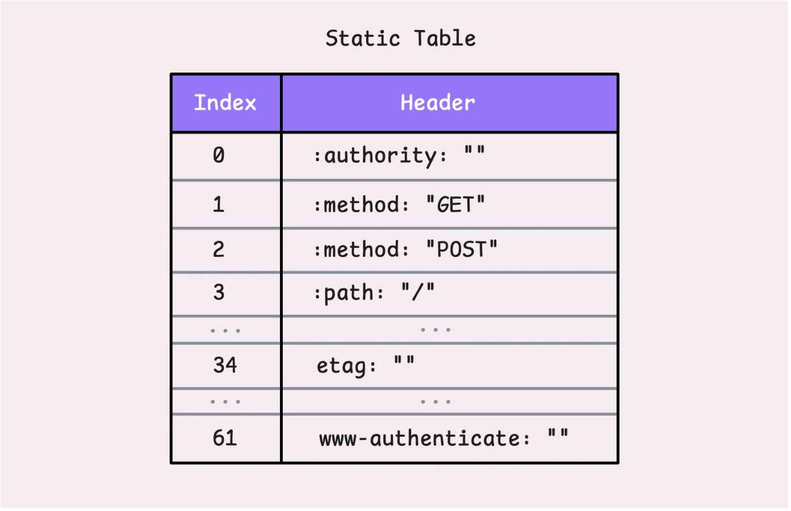
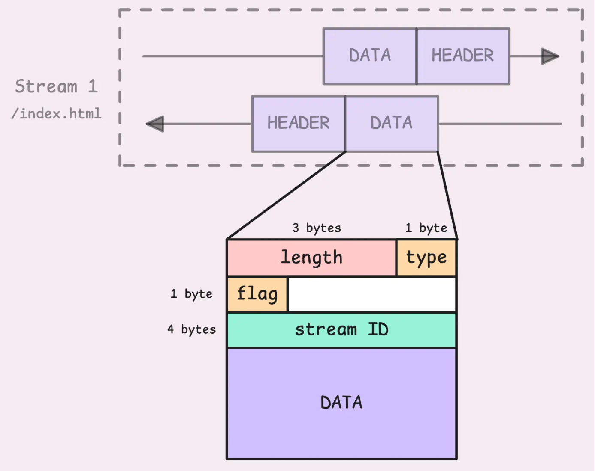
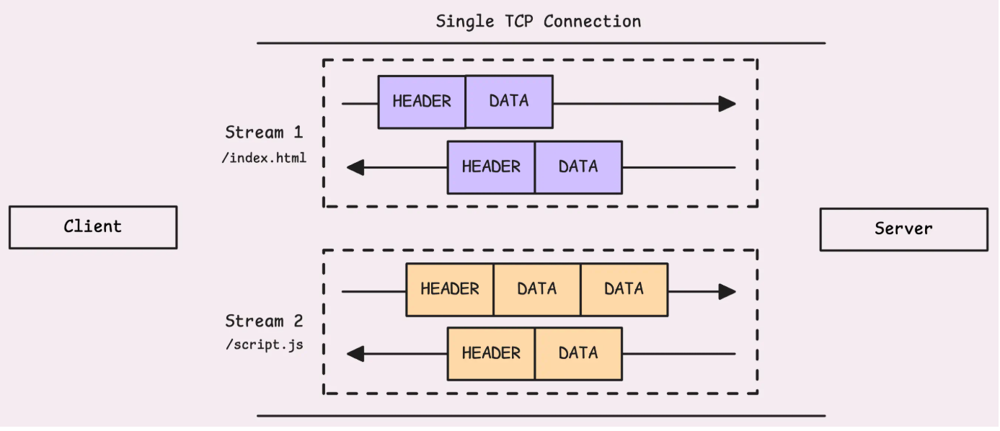

## HTTP/2工作原理

HTTP/1.1 引入了流水线技术，从理论上看，这似乎是一项重大改进。其理念很简单：多个请求可以共享同一个连接，并依次发送，无需等待前一个请求完成。

问题在于请求必须按顺序发出，响应也必须按顺序返回。如果某个响应延迟了——可能是服务器需要更多时间来处理——队列中的其他所有请求都必须等待。

如果网络出现“小故障”，导致某个请求延迟，也会发生这种情况。整个响应流程会停滞，直到延迟的请求通过为止。

这个问题就是所谓的队首阻塞（HoL 阻塞）。

为了克服这一限制，HTTP/1.1 客户端（如您的浏览器）开始向同一服务器打开多个 TCP 连接，从而允许请求更自由、更并发地流动。

虽然这种方法奏效了，但效率并不高：

- 连接数越多，客户端和服务端消耗的资源就越多。
- TCP 协议每次连接都需要进行握手过程，这会增加额外的延迟。

> 那么，HTTP/2 能解决这个问题吗？

 确实如此……嗯，大部分情况下是这样。

### 第一阶段：修路与协商 (TCP + TLS/ALPN)

1. **Establish TCP connection（建立 TCP 连接）**
   - **是什么：** 这是所有网络通信的基础。就像是铺设一条电话线，确保双方能互相传数据。这是通过经典的三次握手完成的。
2. **TLS handshake (including ALPN for HTTP/2)（TLS 握手与 ALPN）**
   - **核心痛点：** 以前，客户端连接服务器时，不知道服务器支不支持 HTTP/2。如果直接发 HTTP/2 的数据，老服务器会报错。
   - **解决方案 (ALPN)：** ALPN（应用层协议协商）是 TLS 握手的一个扩展功能。
   - 过程：
     - **ClientHello：** 客户端在发起加密请求时，会顺便喊一嗓子：“我支持 `h2`（即 HTTP/2）和 `http/1.1`，你选一个吧。”
     - **ServerHello：** 服务器收到后，如果它也支持 HTTP/2，就会在回信中确认：“好的，我们稍后使用 `h2` 协议进行交流。”
   - **结果：** TLS 握手完成后，加密通道建立好了，而且双方都已经私下约定好：“接下来的数据，我们用 HTTP/2 格式发。”

### 第二阶段：确认与防错 (Connection Preface)

1. PRI * HTTP/2.0\r\n\r\nSM\r\n\r\n（连接前序/魔术字符串）
   - **这是什么：** 当加密连接建立好后，客户端发送的第一串数据并不是真正的网页请求，而是一个固定的、长达 24 字节的字节序列。
   - 为什么要发这个？ 这是一个安全锁。
     - 假设服务器出了 Bug，或者中间有某些设备没搞清楚状况，以为这还是 HTTP/1.1 的连接。
     - 这串字符在 HTTP/1.1 协议看来是完全不合法的（`PRI` 不是合法的 HTTP 方法）。这会强制那些不懂 HTTP/2 的老旧服务器或中间设备立刻断开连接或报错，而不是尝试去解析后续的二进制数据，从而避免乱码或潜在的安全漏洞。
   - **简单理解：** 这就像是客户端进门前先对个暗号，只有听得懂暗号（HTTP/2）的服务器才能继续。

### 第三阶段：立规矩 (SETTINGS Frame)

1. **SETTINGS frame（设置帧）**
   - **是什么：** HTTP/2 是一个非常复杂的二进制协议，它支持多路复用（一个连接传多个文件）、头部压缩等高级功能。
   - 过程：
     - **Client 发送 SETTINGS：** “我有这些偏好：比如我一次只能接收多大的包，我允许你同时也发多少个流给我。”
     - **Server 发送 SETTINGS：** “收到了。这是我的规矩：我的最大帧大小是这个，我也限制并发流数量。”
   - **意义：** 双方交换各自的“配置参数”。这不同于发送网页请求，这是在微调连接本身的性能参数。
2. **Connection parameters configured（连接参数配置完成）**
   - 图片最下方的虚线框表示，到这一步，初始化彻底完成了。
   - 现在，客户端可以开始发送真正的 `GET` 请求（获取网页图片、HTML），服务器也可以开始推送数据了。

## HEADERS Frame & HPACK Compression

### 1. 流 ID (Stream ID)：给每个请求编个号

在 HTTP/2 中，因为所有的数据都在同一个 TCP 连接中乱序混传（多路复用），所以必须给每一份数据打上标签，告诉接收方“我是属于哪个请求的”。这个标签就是 **Stream ID**。

- **客户端发起的请求（如浏览器请求网页）：** ID 永远是 **奇数**（1, 3, 5...）。
- 服务器发起的请求（如 Server Push）： ID 永远是 偶数（2, 4, 6...）。
  - *为什么要分奇偶？* 这样客户端和服务器即使同时发起新流，ID 也不会冲突，不需要商量“下一个ID是用7还是8”。
- **ID 0：** 这是一个特殊的保留 ID，不属于任何具体的请求（比如下载图片或网页），它专门用于**连接级别**的控制消息（比如之前的 SETTINGS 帧）。

### 2. 伪头部 (Pseudo-headers)：更有序的格式

在 **HTTP/1.1** 中，请求的第一行（Request Line）是纯文本，例如：
`GET /index.html HTTP/1.1`
这行文字混杂了方法（GET）、路径（/index.html）和协议版本。

**HTTP/2** 废弃了这种模糊的格式，引入了 **伪头部（Pseudo-headers）**。所有以冒号 `:` 开头的头部字段都叫伪头部，它们必须放在普通头部之前。

- 对应关系：
  - `GET` 变成了 **`:method: GET`**
  - `/index.html` 变成了 **`:path: /index.html`**
  - `https` 变成了 **`:scheme: https`**
  - `Host: example.com` 变成了 **`:authority: example.com`**
  - `200 OK` 变成了 **`:status: 200`**

**为什么这么做？** 这样所有的信息都是“键-值”对（Key-Value），格式统一，机器解析起来比解析一行长文本要快得多，也更不容易出错。

### 3. HPACK 压缩：核心黑科技

这是 HTTP/2 最厉害的地方。在 HTTP/1.1 中，如果你刷新 100 次页面，你的浏览器就会把 `User-Agent`、`Cookie` 等相同的头部发送 100 次，非常浪费带宽。

HTTP/2 使用 **HPACK 算法** 解决了这个问题。它不再发送纯文本，而是发送**二进制索引（数字）**。它依赖两张“字典表”：

#### A. 静态表 (Static Table) —— 大家都知道的字典

HTTP/2 协议内置了一张表，里面存了 **61 个**最常用的头部键值对。客户端和服务器都知道这张表。

- **场景 1（完全匹配）：**
  - 你想发送 `:method: GET`。
  - 查表发现它在索引 **2** 的位置。
  - **传输：** 客户端只需要发送数字 **`2`**。服务器收到 `2`，查表一看，就知道你是说 `:method: GET`。节省了大量字节！
- **场景 2（键匹配，值不匹配）：**
  - 你想发送 `etag: abc-123`。
  - 查表发现 `etag` 在索引 **34**，但值不对。
  - **传输：** 发送数字 **`34`**（代表 key 是 etag），然后紧接着发送经过 Huffman 编码压缩后的字符串 `"abc-123"`。

#### B. 动态表 (Dynamic Table) —— 边聊边记的笔记

静态表只有 61 个通用项，那像 `User-Agent`、`Cookie` 或者页面特有的 `etag` 这种每次都不一样或者不再静态表里的数据怎么办？

这就是**动态表**的作用。

- **工作原理：**
  1. 第一次发送一个新的头部（比如 `my-token: xyz`）时，客户端会把它用 Huffman 编码压缩发送过去。
  2. **重点来了：** 客户端和服务器同时把这个 `my-token: xyz` 记在自己的“动态表”里，给它分配一个新的索引号（从 62 开始，比如 62）。
  3. **下一次传输：** 当你再次请求同一网站，需要发 `my-token: xyz` 时，你只需要发送数字 **`62`**。
- **特点：**
  - **有状态（Stateful）：** 这张表是随着连接持续存在的。请求越多，表越丰富，后续传输的数据量就越小。
  - **空间限制：** 这张表不能无限大（默认 4KB）。如果满了，就采用 FIFO 原则，把最早进来的那条删掉，给新的腾位置。

## 数据传输单位——帧（Frame）

为了方便理解，我们可以把它想象成快递物流系统：

### 1. DATA 帧：真正的“货物”

- **用途：** 之前的 `HEADERS` 帧是用来发“运单”的（告诉服务器我要请求什么），而 **`DATA` 帧** 则是用来装真正的“货物”的（比如 POST 请求的 Body，或者服务器返回的 HTML、图片文件等）。
- **拆包（Fragmentation）：** 如果货物太大怎么办？HTTP/2 默认限制一个帧最大为 **16 KB**。所以，一个大的文件会被切分成很多个小的 `DATA` 帧。
- **归属：** 这些切分开的小帧，虽然是分开的，但它们都印着同一个 **Stream ID**，这样接收方就知道它们属于同一个文件。

### 2. 帧的通用结构（Frame Structure）：标准快递盒

这是理解 HTTP/2 的关键。你在图片中看到的那个结构图，是**所有** HTTP/2 帧（无论是 `HEADERS` 还是 `DATA`）都必须遵守的**9 字节统一包头**。

你可以把它想象成一个标准的快递信封，前面 9 个字节是写给快递员看的，后面的才是你的内容。

这 **9 字节（Header）** 包含以下 4 个部分：

1. **Length (3 字节)：**
   - **含义：** 告诉接收方，这之后紧跟着的数据（Payload）有多长。
   - *这就好比信封上写着“内有文件共 500 克”。*
2. **Type (1 字节)：**
   - **含义：** 标记这个帧是什么类型的。
   - **例子：** 如果是 `0x0` 代表 DATA（数据），`0x1` 代表 HEADERS（头部），`0x2` 代表 PRIORITY（优先级）等等。
3. **Flags (1 字节)：**
   - **含义：** 这是一个简单的信号灯，用来传达一些状态。
   - **最重要的 Flag：** `END_STREAM (0x1)`。如果这个位被置为 1，意思就是“这是这个流的最后一个包了，后面没有了”。
4. **Stream ID (4 字节)：**
   - **含义：** 身份证号。标识这个帧属于哪一个请求（Stream）。
   - **细节：** 共 32 位，但第一位保留不用（必须为 0），所以实际可用 31 位。这就是为什么之前说流 ID 是用来区分不同请求的关键。

### 3. 顺序问题：为什么不会乱？

你可能会担心：*“如果 Stream 1 和 Stream 2 的帧混在一起发（多路复用），Stream 1 的第 5 个包会不会跑到第 4 个包前面去？”*

- **流之间：** 是无序的。Stream 1 的包和 Stream 2 的包可以随意穿插（这正是多路复用的目的）。
- **流内部：** 是严格有序的。Stream 1 的 Frame A 绝对会在 Frame B 之前到达。
- 谁来保证？TCP 协议。
  - HTTP/2 是跑在 TCP 之上的。TCP 的核心特性就是**可靠传输**和**顺序保证**。就像一条单向传送带，只要我是按顺序放上去的，TCP 就能保证对面是按顺序拿下来的。
  - 这虽然保证了顺序，但也带来了 **HoL (Head-of-Line) Blocking** 问题：如果 TCP 丢了一个包，后面所有的包（不管是不是同一个 Stream）都要停下来等这个包重传好。

### 4. 完整的交互流程（总结）

1. **请求：**
   - 客户端想请求 `/index.html`。
   - 创建 **Stream 1**。
   - 发送 `HEADERS` 帧（包含 `:method: GET`, `:path: /index.html` 等）。
   - （如果有 Body）发送 `DATA` 帧。
   - 在最后一个帧上打上 `END_STREAM` 标记。
2. **处理与响应：**
   - 服务器收到 Stream 1 的帧。
   - 服务器处理完，准备返回数据。
   - 发送响应的 `HEADERS` 帧（`:status: 200` 等）。
   - 紧接着发送网页内容的 `DATA` 帧（可能分了很多块）。
   - 与此同时，服务器可能还在给 Stream 2 发数据。这些帧在网线上是交替传输的。
3. **重组：**
   - 客户端收到一堆乱序到达的帧。
   - 根据 **Stream ID** 把它们归类。
   - 对于 Stream 1，把它的 `HEADERS` 解压，再把它的 `DATA` 帧按顺序拼起来，最后渲染出网页。

简单来说，**9 字节的帧头**是调度员，**Stream ID** 是归类标签，而 **TCP** 是那条虽然偶尔会卡顿但绝对不乱序的传送带。

## 流量控制

HTTP/2 中如何**结束数据传输**、**关闭连接**以及一些**辅助管理工具**

### 1. 结束单个对话：END_STREAM Flag

当我们传输完一个文件（比如一张图片）后，如何告诉对方“这张图片传完了”？

- **机制：** 发送方在发送最后一个 Frame（通常是 DATA 帧或 HEADERS 帧）时，会将帧头（Frame Header）中的 Flags 字段的 **第 1 位** 设置为 `1`。这个标记被称为 `END_STREAM`。
- **含义：** “关于这个 Stream ID 的数据，我已经发完了，没有后续了。”
- 交互：
  1. 客户端发送请求，最后带上 `END_STREAM`。
  2. 服务器收到后处理请求，发送响应数据，并在响应的最后一帧带上 `END_STREAM`。
- **关键点：** 这只是结束了**当前的这一条流（Stream）**，底层的 TCP 连接依然保持打开状态，其他的流可以继续跑。这就像是在电话会议里，一个人发言结束说了句“Over”，但会议并没有挂断。

### 2. 优雅地挂断电话：GOAWAY 帧

如果服务器想要彻底关闭整个 TCP 连接（比如服务器要重启，或者闲置太久），它不能直接粗暴地断开（这会导致客户端报错），而是使用 **`GOAWAY` 帧**。

- **目的：** 实现 **优雅关闭 (Graceful Shutdown)**。
- 工作原理：
  - 服务器发送 `GOAWAY` 帧给客户端。
  - 帧里包含一个核心信息：**Last Stream ID（最后处理的流 ID）**。
  - **潜台词：** “我要关门了。ID 号码在 X 之前的请求，我会处理完发给你；但是 ID 比 X 大的新请求，我就不接了，你去别的地方连吧。”
- **为什么要等待？** 发送 `GOAWAY` 后，发送方通常会等一小会儿再真正切断 TCP。这是为了让对方有时间收到这个通知并停止发送新请求，避免触发暴力的 **TCP Reset (RST)** 错误，那样会导致正在传输的数据全部丢失。

### 3. HTTP/2 工具箱：其他重要控制帧

1. **WINDOW_UPDATE（流量控制）：**
   - **作用：** 真正的流量控制。用来告诉对方：“我的缓冲区还能装多少数据，请不要发太快撑爆我。”
   - *类比：流水线上的工人喊“慢点，堆不下了”。*
2. **PING（心跳检查）：**
   - **作用：** 检查连接是否还活着，或者计算网络延迟（RTT）。
   - *类比：你在电话里问“喂？你还在吗？”*
3. **PRIORITY（优先级）：**
   - **作用：** 调整流的优先级。比如告诉服务器：“先传 CSS 和 JS 文件，图片可以慢点传。”
   - *类比：给急件贴上“VIP”标签。*
4. **RST_STREAM（重置流）：**
   - **作用：** 紧急终止某一个特定的流，但不影响连接中的其他流。
   - **场景：** 用户点击了浏览器上的“停止加载”按钮，或者上传文件发了一半发现发错了。客户端发送 `RST_STREAM` 说“这个请求我不要了，别发了”，但其他网页资源可以继续加载。