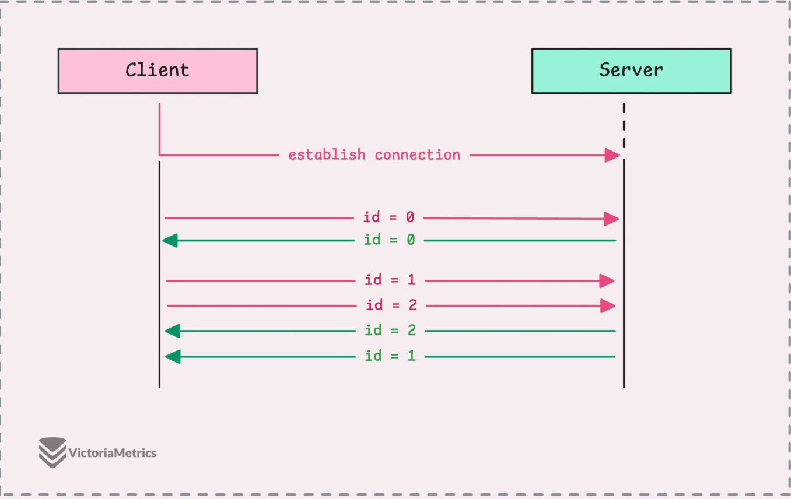

## 前言

### 1. 什么是 RPC？（核心思想）

**全称**：Remote Procedure Call（远程过程调用）

- REST (普通方式)：

  想象你要给朋友发信息让他办事。你需要知道他的地址（URL），要写一封格式规范的信（JSON），贴上邮票（HTTP Header），然后投递。

  - 代码里大概长这样：`http.get("https://api.site.com/users/123")`。你很清楚你在“发请求”。

- RPC (gRPC方式)：

  你就像在和你身边的人说话一样，直接喊他的名字让他办事。你不需要关心他在哪里，也不用管声音是怎么传过去的。

  - 代码里大概长这样：`userService.GetUser(id)`。
  - **关键点**：你看似在调用自己代码里的一个函数（Function），但实际上这个函数是在**另一台服务器**上运行的。gRPC 把底层的网络通信、数据打包全都隐藏起来了，让你感觉像是在写本地代码一样

### 2. HTTP/2 是怎么回事？（传输通道）

文中提到了 HTTP/1.1 和 HTTP/2 的区别，这是 gRPC 快的原因之一。

- HTTP/1.1 (传统 REST)：
  - **比喻**：你去超市买5样东西。你进超市买一样，出来结账，回家；再进超市买第二样，出来结账，回家……（这就叫每次建立一个新的 TCP 连接）。
  - 浏览器为了快一点，会同时派6个人（6个连接）去帮你买，但还是很累。
- HTTP/2 (gRPC)：
  - **比喻**：你进超市，推着一辆大车，一次性把所有东西拿完，或者你和收银员之间建立了一条**传送带**。
  - **多路复用 (Multiplexing)**：这就是文中说的“Clever trick”。在一个连接（电话线）里，可以同时并发处理无数个请求和响应，不再需要反复建立连接。

### 3. 如何在一条线上处理多个请求？（Sequence Number）

**Sequence Number（序列号）** 和 TCP 连接复用。

想象一下，你（客户端）和服务器之间只有**一条电话线**（TCP 连接）。
为了省事，你不想挂电话，想在这一通电话里连续办好几件事。

- **客户端说**：
  1. （ID: 0）帮我查查 User A 的名字。
  2. （ID: 1）帮我查查 User B 的名字。
  3. （ID: 2）帮我查查 User C 的名字。
- **服务器处理速度不一样**，结果返回的顺序可能是乱的：
  - 先查到了 User B（因为数据在缓存里，快）。
  - 再查到了 User A。
- **如果没有序列号**：客户端收到结果时就懵了——“这回来的‘张三’到底是 User A 还是 User B 的名字？”
- **有了序列号 (ID)**：
  - 服务器返回：`{ "id": 1, "result": "李四" }` -> 客户端知道这是 User B 的结果。
  - 服务器返回：`{ "id": 0, "result": "张三" }` -> 客户端知道这是 User A 的结果。

### 4. 为什么说它比 gRPC 慢？（Reflection 反射）

- gRPC 的做法：
  - 通过 `.proto` 文件，**提前**生成好代码。代码里写死了：“如果收到请求 A，就直接跳到内存地址 X 去执行”。这叫静态绑定，速度极快。
- net/rpc 的做法：
  - 没有提前生成代码。当请求 `"Service.Hello"` 过来时，服务器程序需要**在运行时**去查字典：“等一下，我有这个函数吗？它的参数是什么类型的？哦，找到了，我再把数据塞进去。”
  - 这种“运行时动态查找”的过程就是**反射**。它非常灵活（不需要写 .proto 文件），但是比 gRPC 那种“硬编码”的方式要慢。

