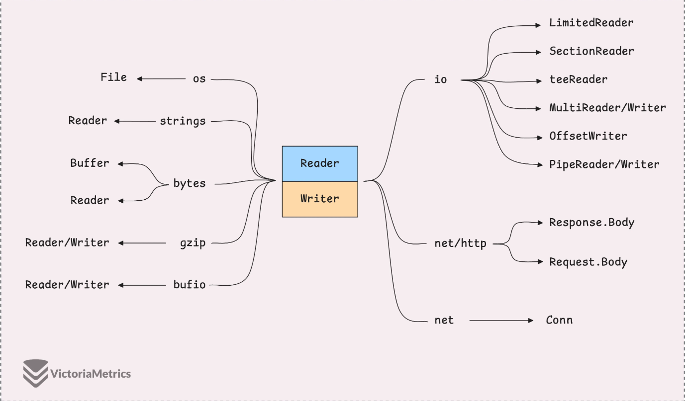
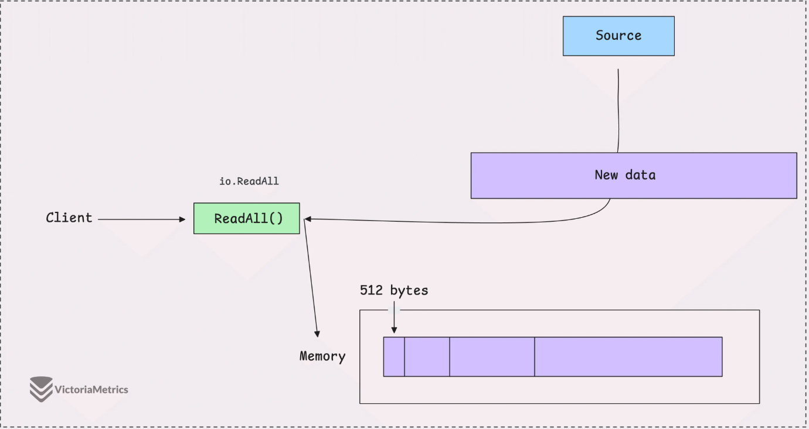
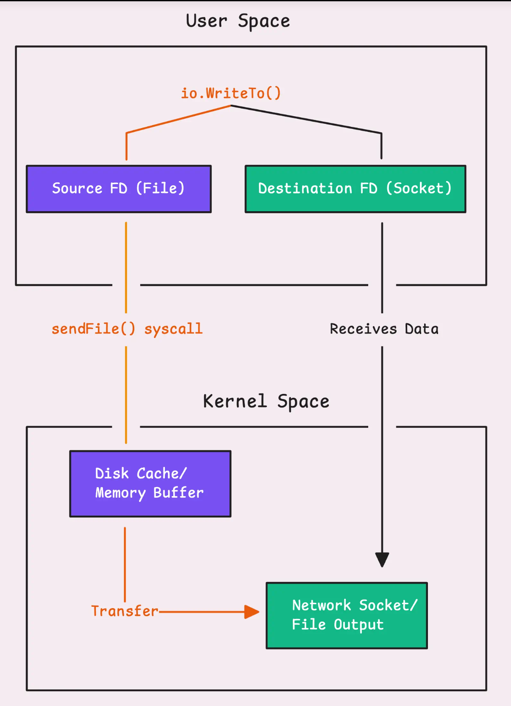

# 前瞻

在 Go 语言中，`string` 类型在底层实际上是一个很小的结构体（Header），它包含两个字段：

1. **指向底层字节数组的指针**（Data Pointer）
2. **字符串的长度**（Length）

```go
data := "Hello Go"

// 1. 普通字符串：你只能整体访问，或者通过下标访问
fmt.Println(data[0]) // 输出 'H' 的 ASCII

// 2. 变成 Reader
// 把 data 这个“描述符”（指针和长度）赋值给了 Reader 内部的 s 字段。已经和数据本身的大小没关系了
// strings.NewReader还有记录了一个偏移量
reader := strings.NewReader(data)

buf := make([]byte, 5)
reader.Read(buf) // 从偏移量开始，拷贝数据到buf中，第一次读，buf 变成 "Hello"，偏移量移到 5
fmt.Println(string(buf)) 

reader.Read(buf) // 第二次读，偏移量从 5 开始，读到 " Go"，偏移量到 8
fmt.Println(string(buf[:3])) // 只读到了 3 个有效字节
```

示例代码

```go
package io

import (
	"fmt"
	"io"
	"strings"
)

func ReadFile() {
	// 1. 模拟一个数据源（实现了 io.Reader 接口）
	data := "The design philosophy of the Go language: simplicity, efficiency, and reuse."
	reader := strings.NewReader(data)

	// 2. 关键点：在循环外部创建一个“容器”（缓冲区）
	// 这里我们只给 8 个字节的空间，模拟多次读取的过程
	buf := make([]byte, 8)

	fmt.Printf("开始读取，初始缓冲区地址: %p\n", &buf[0])
	fmt.Println("------------------------------------")

	for {
		// 3. 将容器 buf 传给 Read 方法
		// Read 不会创建新切片，而是尝试填满你给它的 buf
		n, err := reader.Read(buf)

		if n > 0 {
			// 4. 处理读到的数据
			// 注意：必须使用 buf[:n]，因为 buf 后面的部分可能还留着上次读取的旧数据
			fmt.Printf("读取字节数: %d | 内容: [%s] | 当前缓冲区首地址: %p\n",
				n, string(buf[:n]), &buf[0])
		}

		// 5. 判断是否读完（EOF）或报错
		if err == io.EOF {
			fmt.Println("------------------------------------")
			fmt.Println("读取完毕：已到达文件末尾 (EOF)")
			break
		}
		if err != nil {
			fmt.Printf("读取出错: %v\n", err)
			break
		}
	}
}
```

# Go I/O 读取器、写入器和动态数据



## 什么是io.Reader

```go
type Reader interface {
    Read(p []byte) (n int, err error) //返回 读取的字节数和err？
}
```

**p**可以是任何东西——文件、网络连接，甚至只是一个简单的字符串，但 `io.Reader` 并不关心数据来自哪里。它只知道有数据存在，它的任务是将这些数据复制到你指定的切片中。

`Read` 并不保证会填满整个切片。它会返回实际读取的数据量 ` `n` 。当没有更多数据可读时，它会返回 io.EOF` 错误，这基本上意味着你已经到达了数据流的末尾。

**需要注意的是：**即使 `err` 不是 `nil`，你**也必须**先检查 `n` 是否大于 0。如果你习惯了“只要有错就不看数据”，你就会丢掉最后读取到的字节。

## os.File是一个Reader

当你想从文件中读取数据时，可以使用 `os.Open(..)` ，它会打开文件并返回一个实现了 `io.Reader` 接口的 `*os.File` 对象。

```go
f, err := os.Open("test.txt")
if err != nil {
   panic("无法加载核心配置: " + err.Error()) //手动panic,但是不要用 panic 来做正常的错误处理。
}
//一个进程能同时打开的文件数量是有上限的。
//如果不关闭，每打开一个文件就会占用一个文件描述符。如果你的程序长期运行（比如一个服务器），很快就会报 "too many open files" 错误导致崩溃。
defer f.Close() 
```

`os.Open`：向操作系统申请“通行证”：

+ 当你调用 `os.Open("test.txt")` 时，底层发生了这些事：
  + **系统调用**：Go 向操作系统发送请求，要求打开该文件。
  + **只读权限**：`os.Open` 默认是以**只读**模式打开的。如果你想写文件，需要用 `os.OpenFile`。
  + **文件描述符**：操作系统会返回一个数字（文件描述符），Go 把这个数字封装在 `*os.File` 结构体中。
+ **注意：** 此时文件内容**并没有**被读入内存。你只是拿到了一个可以去“打水”的“水龙头”。

一旦你获得了 `*os.File` ，你就可以像对待其他任何读取器一样对待它。你将其内容读入缓冲区，并不断读取直到遇到 `io.EOF` 。

```go
// Make a buffer to store the data
for {
    // Read from file into buffer
    n, err := f.Read(buf)

    // If bytes were read (n > 0), process them
    if n > 0 {
        fmt.Println("Received", n, "bytes:", string(buf[:n]))
    }

    // Check for errors, but handle EOF properly
    if err != nil {
        if err == io.EOF {
            break // End of file, stop reading
        }
        panic(err) // Handle other potential errors
    }
}
```

## io.ReadAll的陷阱和io.Copy

`io.ReadAll`可以一次性获取所有数据，例如读取 HTTP 响应的整个主体、加载整个文件或从流中提取所有内容。

```go
func main() {
    f, err := os.Open("test.txt")
    if err != nil {
        panic(err)
    }
    defer f.Close() // no error handling

    body, err := io.ReadAll(f)
    ...
}
```

`io.ReadAll` 非常方便——它隐藏了读取数据的所有细节，并自动处理字节切片的增长。它初始缓冲区大小为 512 字节，如果数据更大，缓冲区会使用 `append()` 函数增长。尽管它使用方便，但一个主要问题是它对读取的数据量没有任何限制。



当你遇到以下情况时：在系统之间传递数据、转发 HTTP 请求正文、读取文件并通过网络发送、下载并保存某些内容，你会有一个很棒的工具： `io.Copy` -真正的救星。

## 什么是io.Writer

`io.Writer` 的 `Write` 方法的方法签名与 `io.Reader` 的 `Read` 方法非常相似：

```go
type Writer interface {
    Write(p []byte) (n int, err error)
}
```

**输入 `p []byte`**：这是你的“弹药箱”。你想把这里面的所有字节都发射出去（写入文件或网络）。

返回值 `n` 表示实际写入的字节数。理想情况下， `n` 应该等于 `len(p)` ——这意味着整个切片都被写入了——但这并非总是能够保证。如果 `n` 小于 `len(p)` ，则表示只写入了部分数据，而 `err` 会告诉你哪里出了问题，不算成功，这在 Go 中被称为 **Short Write（短写）**。

- 这意味着出大事了！比如磁盘满了、网线断了。
- 按照 Go 的规范，如果 `n < len(p)`，`Write` 方法**必须**同时返回一个非空的 `err` 来解释原因。

### 场景：构建一个日志写入器或数据保存函数

假设我们要写一个函数，把一段敏感数据写入到某个地方（可能是文件，可能是网络连接）。我们需要确保数据**完整地**写进去了，绝不能只写一半。

```go
package main

import (
	"errors"
	"fmt"
	"io"
	"os"
)

// SafeWrite 尝试将数据写入 writer，并确保数据完整性
func SafeWrite(w io.Writer, data []byte) error {
	// 调用核心的 Write 方法
	n, err := w.Write(data)
	
	// 1. 优先检查常规错误 (比如文件被锁定、权限不足)
	if err != nil {
		return fmt.Errorf("写入出错: %w", err)
	}

	// 2. 检查 Short Write (短写)
	// 虽然标准库规定 err != nil 时 n 才会 < len(data)
	// 但防御性编程习惯会让我们再次确认是否所有字节都写进去了
	if n != len(data) {
		// 这是一个严重的逻辑问题，说明底层可能默默失败了或者 buffer 满了
		return errors.New("写入不完整: io.ErrShortWrite")
	}

	fmt.Printf("成功写入 %d 字节\n", n)
	return nil
}

func main() {
	// 打开文件
	f, err := os.Create("data.txt")
	if err != nil {
		panic(err)
	}
	defer f.Close()

	data := []byte("Hello, World!")

	// 使用我们封装好的函数
	if err := SafeWrite(f, data); err != nil {
		fmt.Println("严重错误:", err)
	}
}
```

# I/O Closer、Seeker、WriterTo 和 ReaderFrom

```go
type ReadWriter interface {
	Reader
	Writer
}

type ReadWriteCloser interface {
	Reader
	Writer
	Closer
}
```

## io.Closer

`Closer` 接口旨在处理需要自行清理的对象，具体来说，就是在使用完毕后释放资源。

```
type Closer interface {
	Close() error
}
```

大多数时候，你不会看到 `Closer` 单独出现。

在 Go 标准库中，它通常与其他接口捆绑在一起，例如 `io.ReadCloser` 、 `io.WriteCloser` 或 `io.ReadWriteCloser` 。例如，当您完成对文件、网络连接或数据库的操作后，您可以调用 `Close()` 方法来清理并释放资源。

那么，如果多次调用 `Close()` 会发生什么呢？

以 `os.File` 为例，如果您尝试再次关闭它，将会抛出 `os.ErrClosed` 错误。另一方面， `net/http` 包中的 `Response.Body` 可能根本不会报错。

> “如果我忘记关闭文件怎么办？会造成内存泄漏吗？”*

当你打开一个文件时，操作系统会分配一个叫做**文件描述符**的东西。如果你没有正确关闭该文件，文件描述符就会一直存在。如果你不断地打开文件而不关闭它们，系统最终可能会耗尽可用的文件描述符。当这种情况发生时，你会遇到类似 *“打开的文件过多”的错误。*

但别担心，Go 会为你保驾护航。如果你忘记关闭文件，Go 的垃圾回收器可能会在文件对象不再使用时介入并为你清理文件描述符。

## io.Seeker

打开文件（或者任何资源，例如缓冲区或网络流）时，默认行为是按顺序读取或写入数据，从开头开始向前推进。但有时，您需要更精细的控制，例如跳转到文件中的特定位置，或者返回并重新读取某些内容。

```go
type Seeker interface {
	Seek(offset int64, whence int) (int64, error)
}
```

`o.Seeker` 是 Golang 中处理二进制数据、大文件和自定义文件格式时最核心的接口之一。

简单来说，**`io.Seeker` 给了你“像播放器进度条一样”随意拖动读取位置的能力。**

### 1. 通俗解释：什么是 Seek？

想象你在看一部电影（这就是一个大文件）：

- **默认读取 (`io.Reader`)**：就像以前的**录像带 (VHS)**。你必须从头看到尾，如果想看结局，得一直快进经过中间所有内容。
- **Seek (`io.Seeker`)**：就像现在的**视频播放器进度条**。
  - `io.SeekStart` (从头算)：你直接点击进度条的 **05:00** 处开始看。
  - `io.SeekCurrent` (从当前算)：你觉得刚才没看清，点击“**倒退 10 秒**”。
  - `io.SeekEnd` (从尾算)：你想看片尾彩蛋，直接跳到**倒数 1 分钟**。

在代码中，**光标 (Cursor/Offset)** 就是那个播放进度点。

### 2. 示例代码

```go
package main

import (
	"fmt"
	"io"
	"os"
)

func main() {
	// 1. 创建一个模拟的日志文件
	f, _ := os.Create("app.log")
	// 假设前面写入了成千上万行日志...
	f.WriteString("Log line 1...\n")
	f.WriteString("Log line 2...\n")
	f.WriteString("... (假设这里有100万行) ...\n")
	// 这是我们需要看到的最后一行关键错误
	f.WriteString("ERROR: Database connection failed!") 
	f.Close()

	// 2. 打开文件准备读取
	file, _ := os.Open("app.log")
	defer file.Close()

	// --- 关键操作 ---
	// 我们不想从头读，直接跳到末尾。
	// Offset: -32 (从参照点往回倒退32个字节，估计够覆盖最后一行了)
	// Whence: io.SeekEnd (参照点是文件末尾)
	file.Seek(-32, io.SeekEnd)

	// 3. 读取剩余的内容
	buf := make([]byte, 1024)
	n, _ := file.Read(buf)

	fmt.Printf("只读取文件末尾的内容:\n%s", string(buf[:n]))
}
```

## io.WriterTo



+ 用户空间和内核空间
  + **上半部分（User Space - 用户空间）**：你的 Go 程序跑在这里。它很安全，但权限很低，它**拿不到**磁盘上的文件，也**碰不到**网卡。
  + **下半部分（Kernel Space - 内核空间）**：操作系统的“老巢”。它直接管理硬件（磁盘、网卡）。所有的文件数据，其实都先存在这里的**内存缓冲区**里。

+ 关键组件

  + **Source FD (File)**：FD 叫“文件描述符”。你可以把它理解为**文件的钥匙**。你的程序手里拿着这把钥匙。
  + **Destination FD (Socket)**：这是**网线的钥匙**。你想把文件发给别人，就得往这个“钥匙”指向的地方写数据。
  + **Disk Cache (磁盘缓存)**：文件从硬盘读出来后，其实是先放在内核空间的这个“抽屉”里。
  + **Network Socket (网络接口)**：这是数据发出去之前的最后一站。

+ 详细解读图中那条“橙色的线” 

  以前传统的做法（没有 `io.WriteTo` 的时候），数据传输像搬砖：

  1. **第一步**：操作系统把数据从磁盘读到内核的抽屉里。
  2. **第二步**：你的程序把数据从内核抽屉“搬”到用户空间的内存里。（**第一次拷贝**）
  3. **第三步**：你的程序再把数据从用户空间“搬”回内核的网络抽屉里。（**第二次拷贝**）
  4. **第四步**：操作系统把数据发出去。

  **你看，数据在“用户空间”转了一圈，啥也没干，白白浪费了两次搬运的体力（CPU 和内存）。**

+ 现在看图中的橙色路径：

  当你使用 `io.WriteTo` 且底层触发了 **`sendFile()` 系统调用**时：

  1. **发出指令**：你的 Go 程序（User Space）不再搬砖了，而是直接大喊一声：“**操作系统，我把这两把钥匙（Source FD 和 Destination FD）都给你，你自己直接在后台把数据从文件抽屉转到网络抽屉吧！**”
  2. **内核操作 (Transfer 橙色箭头)**：操作系统收到指令，直接在内核空间内部完成了数据转移。
  3. **结果**：数据**完全没有经过** User Space。

  **这就是“零拷贝”：对于你的 Go 程序（用户空间）来说，它没有亲手拷贝数据，数据就在底层完成了流转。**

## io.ReaderFrom

### 1. 设计意图：谁在主动？

在标准的 I/O 操作中（比如使用 `io.Copy`），通常有一个“中间人”或者“搬运工”。流程是这样的：

1. 搬运工从源头（Reader）读一部分数据到**临时桶（Buffer）**里。
2. 搬运工把桶里的数据倒进目的地（Writer）。
3. 重复这个过程。

**`io.ReaderFrom` 的设计则是改变了这个流程：**
它让**目的地（Writer）**变得更智能、更主动。

- **字面意思**：`ReadFrom` = "Read from ..."（从...读取）。
- **实际行为**：目的地（比如一个文件）说：“不要找搬运工了，把源头（Reader）直接给我，我自己从里面吸数据。”

**关键点：** 这个接口通常是由**写入者（Writer）**实现的。虽然名字叫 `ReaderFrom`，但它是一个为了让 Writer 更高效地获取数据而设计的接口。

### 2. 代码详解

让我们逐行分析你提供的示例代码：

```go
func main() {
    // 1. 创建一个目的地（Destination）。
    // os.File 既实现了 io.Writer，也实现了 io.ReaderFrom。
    f, _ := os.Create("destination.txt") 
    defer f.Close()

    // 2. 创建一个数据源（Source）。
    // strings.Reader 实现了 io.Reader。
    r := strings.NewReader("This is some data to be read")

    // 3. 关键步骤：调用 f.ReadFrom(r)
    // 这里不再使用 io.Copy(f, r)，而是直接让文件对象 f 去读取 r 的数据。
    n, _ := f.ReadFrom(r)
    
    fmt.Printf("Read %d bytes\n", n)
}
```

**发生了什么？**

- 对象 `f`（文件）知道自己是一个文件系统对象。
- 对象 `r`（字符串读取器）是一块内存中的数据。
- 当调用 `f.ReadFrom(r)` 时，`f` 会检查 `r` 是什么。如果 `f` 发现这是一种它可以“走捷径”的数据源，它就会使用最快的方式把数据弄进来，跳过普通的读写循环。

------

### 3. 核心难点：为什么更高效？（优化与 Fallback）

文中提到：*“如果你的操作系统支持更高效的方式来移动数据，ReadFrom() 就会使用它。否则，它会回退到标准的 io.Copy() 方法...”*

这里有两个层面的解释：

#### A. 减少内存拷贝（Buffer 优化）

假设我们要把数据写入一个带缓冲的 Writer（比如 `bufio.Writer`）：

- **普通方式**：数据从 Source -> 临时 Buffer -> bufio 的 Buffer -> 最终文件。这里多了一次“临时 Buffer”的中转。
- **ReadFrom 方式**：`bufio.Writer` 实现了 `ReadFrom`，它可以直接把数据从 Source 读到自己的 `bufio` Buffer 中，省去了一次中间拷贝。

#### B. 操作系统级别的优化（Zero Copy / System Calls）

这是文中提到的 `os.File` 的例子。
在某些操作系统上，如果源（Reader）和目的地（Writer）都是文件或 socket，`ReadFrom` 可能会利用特殊的系统调用（如 Linux 的 `sendfile` 或 `splice`，尽管这更多用于 WriterTo，但原理类似）。
这意味着数据可以直接在**操作系统内核**中从一边传输到另一边，而不需要先拷贝到 Go 程序的内存（用户态），再拷贝回操作系统。这被称为“零拷贝”（Zero Copy），速度极快且节省 CPU。

#### C. Fallback（回退机制）

文中提到的“fallback”是指：
如果 `f`（文件）发现传进来的 `r` 只是一个普通的 Reader，没有任何系统级的优化可用，那么 `f.ReadFrom(r)` 内部就会**自动降级**，执行一个类似于普通 `for` 循环的代码：

1. 申请一个 32KB 的缓冲区。
2. `r.Read()` 到缓冲区。
3. `f.Write()` 写入文件。
4. 循环直到结束。

这就是文中说的 *“chunking through the data 32 KB at a time”*（每次处理 32KB 数据块）。

### 总结

1. **`io.ReaderFrom` 接口**：定义了一个 `ReadFrom` 方法，允许对象直接从一个 Reader 拉取数据。
2. **主要实现者**：通常是 `io.Writer` 类型（如 `os.File`, `bytes.Buffer`, `bufio.Writer`）。
3. **核心价值**：**性能**。它给了实现者（目的地）一个机会，根据源头的类型，选择最快、最省内存的方式来传输数据。
4. **保底策略**：如果无法优化，它依然能工作，只是退化成普通的读写循环。

简单来说，用 `f.ReadFrom(r)` 就像是给文件 `f` 开了“上帝视角”，让它自己决定怎么最快地把 `r` 里的数据吃掉，而不是傻傻地等人喂。

## io.ByteReader/Writer & io.RuneReader/Writer

在常规的 I/O 操作（如 `io.Reader`）中，我们通常是一次读写“一大块”数据。但有时候，我们只需要处理**一个字节**或者**一个字符**。为了不杀鸡用牛刀，Go 提供了这些专用接口。

### 1. 字节级操作：`io.ByteReader` / `io.ByteWriter`

**场景：** 只需要读写**一个字节**（Byte）时。

#### 为什么需要它？

普通的 `Read` 方法需要你先创建一个切片（比如 `b := make([]byte, 1)`），然后传进去，这对于只读一个字节来说太繁琐了。

- `io.ByteReader` 提供了 `ReadByte()`：直接返回一个 `byte`。
- `io.ByteWriter` 提供了 `WriteByte(c byte)`：直接写入一个 `byte`。

#### 代码示例解读（JSON 修改）：

```go
func main() {
    data := `{"name": "VictoriaMetrics", "age": 8}`
    reader := strings.NewReader(data) // 这是一个内存读取器
    var b byte
    for {
        // 每次只读这一个字节
        b, _ = reader.ReadByte()
        
        // 简单的逻辑判断：如果是字符 '8'，就偷偷改成 '9'
        if b == '8' {
            b = '9'
        }
        fmt.Printf("%c", b)
    }
}
```

**解释：** 这就像流水线上的工人，不再是一箱一箱地搬货，而是手里拿着放大镜，一个零件一个零件地检查和修改。这在解析二进制协议或进行简单的流式修改时非常有用。

------

### 2. 字符级操作：`io.RuneReader` （核心重点）

**场景：** 处理**文本**内容，尤其是包含中文、Emoji 等**多字节字符**时。

#### 核心概念：Byte vs. Rune

这是理解这段内容的关键：

- **Byte (字节)**：计算机存储的最小单位。
- Rune (符文/字符)：Go 语言中对 Unicode 字符的称呼。
  - 英文字母 'A'：在 UTF-8 编码中占 **1个** 字节。
  - 中文 '好' 或 Emoji '🌍'：在 UTF-8 编码中通常占 **3个或4个** 字节。

#### 为什么 `ReadByte` 在处理文本时会失败？

如果你用 `ReadByte` 去读一个 Emoji '🌍'（它由 4 个字节组成），你会读 4 次，每次读到 1/4 个 Emoji。这 1/4 个 Emoji 单独拿出来是乱码，没有任何意义。

#### `ReadRune` 的智能之处

`ReadRune()` 是“懂” UTF-8 编码的。

1. 它读取第一个字节。
2. 它发现：“咦，这是一个多字节字符的开头。”
3. 它会自动继续读取后续的 2 个或 3 个字节。
4. 它把这几个字节拼在一起，解码成一个完整的字符（Rune）返回给你。

#### 代码示例解读（Emoji 对比）：

```go
// 数据：Hello 后面跟着一个地球 Emoji
data := "Hello 🌍" 

// --- 方式一：用 ReadByte (笨办法) ---
// 结果：
// H, e, l, l, o, 空格 -> 这些都是单字节，读取正常。
// 到了 🌍 -> 它占4个字节。
// ReadByte 读了第1个字节 -> 乱码 (ð)
// ReadByte 读了第2个字节 -> 乱码 (\u009f)
// ...
// 结论：把地球撕碎了，没法看。

// --- 方式二：用 ReadRune (聪明办法) ---
// 结果：
// H, e, l, l, o, 空格 -> 正常。
// 到了 🌍 -> ReadRune 发现这是一个大字符，一次性读走4个字节，合并。
// 返回：🌍 (size: 4 bytes)
// 结论：完整地识别了字符。
```

### 3. 性能背后的逻辑：bufio`？

**问题：**
假设你在读一个文件（硬盘）或网络请求。
如果你在一个 `for` 循环里调用 `ReadByte()` 读 1000 次：

- **没有缓冲时**：程序会向操作系统发起 1000 次“系统调用”（System Call）。系统调用很昂贵（慢），这会让程序运行效率极低。

**解决：**
这就是为什么这些接口通常由 `bufio.Reader` 或 `bytes.Buffer` 这种带缓冲的类型来实现。

1. 当你第一次调 `ReadByte()` 时，`bufio` 会悄悄从硬盘一次性读取 4096 个字节（一大块）存到内存里。
2. 然后给你返回第 1 个字节。
3. 当你调第二次 `ReadByte()` 时，它直接从内存里给你第 2 个字节（极快）。
4. 直到内存里的 4096 个字节用完，它才再次去访问硬盘。

### 总结

1. **`io.ByteReader/Writer`**：用于**二进制数据**处理，或者当你确定数据全是单字节（如纯 ASCII 英文）时，操作最底层的一个字节。
2. **`io.RuneReader`**：用于**文本处理**。它能自动处理 UTF-8 编码的复杂性，确保你读到的是完整的“字”，而不是破碎的“字节”。
3. **最佳实践**：当你使用这些“单字节/单字符”读取方法时，务必配合 **Buffered Reader**（如 `bufio`），否则性能会很差。
