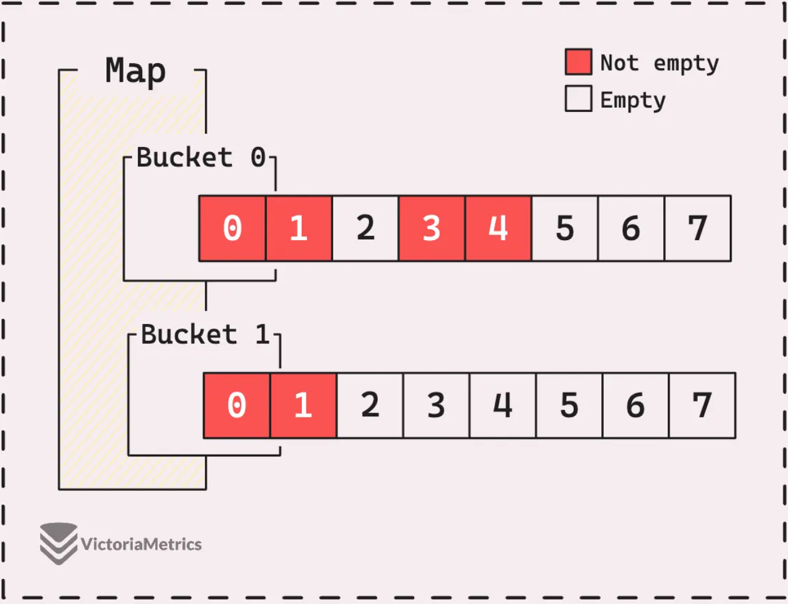

# 前瞻

原文链接：https://victoriametrics.com/blog/go-map/

关于 Go 语言中的map，您应该了解以下几点：

+  遍历顺序不固定

  Go 语言为了防止程序依赖于某种特定的哈希实现（同时也为了防止 Hash DoS 攻击），**故意**在遍历时引入了随机性。这意味着，即使你没有修改 map，运行两次相同的遍历代码，输出的顺序也可能不同。

- 非线程安全 

  **什么是线程安全？** 如果多个线程（在 Go 里是 Goroutine）同时操作同一个数据结构而不会出错，就是线程安全的。

  **Go Map 的行为：** 普通的 `map` 不是线程安全的。

  - 如果是**并发读**（多个 goroutine 同时读取），没问题。
  - 如果是**并发写**，或者一个读一个写，Go 运行时（Runtime）会检测到竞争状态，直接抛出一个 **Fatal Error（致命错误）**，导致整个程序崩溃（Panic 且无法被 recover 捕获）。

  ```go
  // 这是一个会崩溃的代码
  func main() {
      m := make(map[int]int)
  
      // 开启一个 goroutine 写
      go func() {
          for {
              m[1] = 1 // 写操作
          }
      }()
  
      // 主 goroutine 读
      for {
          _ = m[1] // 读操作 -> 此时程序会报 fatal error: concurrent map read and map write
      }
  }
  ```

  **解决方法：**

  1. 使用 `sync.Mutex`（互斥锁）在读写时加锁。
  2. 使用 `sync.Map`（Go 标准库提供的并发安全 Map）。

- 判断键是否存在 
  在 Go 中，如果你去读取一个**不存在**的键，Go 不会报错，而是返回该类型的**零值**（Zero Value）。

  - 如果是 `map[string]int`，读取不存在的键返回 `0`。
  - 如果是 `map[string]string`，读取不存在的键返回 `""`（空字符串）。

  这会导致一个问题：如果我读到了 `0`，是因为这个键对应的值真的是 0，还是因为这个键根本不存在？

  为了解决这个问题，Go 提供了 `value, ok := m[key]` 的语法：

  - `value`: 取出的值（如果不存在则是零值）。
  - `ok`: 布尔值（bool）。`true` 表示键存在，`false` 表示键不存在。

  ```go
  package main
  
  import "fmt"
  
  func main() {
      scores := map[string]int{
          "Tom": 60,
          "Jerry": 0, // Jerry 考了 0 分
      }
  
      // 查询 Jerry
      score, ok := scores["Jerry"]
      if ok {
          fmt.Printf("Jerry 存在，分数是: %d\n", score) // 输出: 0
      }
  
      // 查询 Spike (不存在)
      score, ok = scores["Spike"]
      if !ok {
          fmt.Println("Spike 不在名单里")
      } else {
          fmt.Println("Spike 存在", score)
      }
      
      // 如果不检查 ok，直接取值
      val := scores["Spike"]
      fmt.Println(val) // 输出 0，容易产生误解
  }
  ```

- 键的类型必须可比较 

  Map 的底层原理是哈希表，它需要判断两个键是否“相等”来定位值。因此，作为 Map 的 Key 的类型，必须支持 `==` 和 `!=` 操作符。

  - **合法的 Key 类型：**
    - 基本类型：`bool`, `int`, `float`, `string`, `complex`
    - 指针 `pointer`
    - 通道 `channel`
    - 接口 `interface`（只要动态类型是可比较的）
    - **数组** `[5]int`（注意是数组，不是切片）
    - **结构体** `struct`（前提是结构体里的每个字段都是可比较的）
  - **非法的 Key 类型（不可比较）：**
    - **切片** `[]int` (slice)
    - **Map** `map[string]int`
    - **函数** `func()`
    - 包含上述类型的结构体

# Map刨析

Go 代码中的单个映射实际上是一个抽象层，它隐藏了数据组织方式的复杂细节。实际上，Go map是由许多称为“buckets”的更小单元组成的。

```go
type hmap struct {
  ...
  buckets unsafe.Pointer
  ...
}
```

其中 map 包含一个指向 bucket 数组的指针。这就是为什么当你将一个map分配给一个变量或将其传递给一个函数时，该变量和函数的参数都共享同一个映射指针。

```go
func changeMap(m2 map[string]int) {
  m2["hello"] = 2
}

func main() {
  m1 := map[string]int{"hello": 1}
  changeMap(m1) //复制了一份m1的指针给函数，所有可以修改原始数据
  println(m1["hello"]) // 2
}
```

```go
func changeMap(m2 map[string]int) {
  m2 = map[string]int{"hello": 2}
}

func main() {
  m1 := map[string]int{"hello": 1}
  changeMap(m1)//虽然复制了一份m1的指针给函数，但是指针的值指向了一个新Map地址
  println(m1["hello"]) // 1
}
```



 上图Go 语言中 `map` 底层数据结构中最核心的部分：**Bucket（桶）**。

如果把 `map` 比作一个大仓库，那么 **Bucket** 就是仓库里的一排排货架。

**桶的内部构造：固定的 8 槽位**

图片中显示的 `Bucket 0` 和 `Bucket 1` 各有 8 个格子（编号 0-7）。

- **固定容量：** 在 Go 的源码中，每个桶被设计为只能存放 **8 个键值对（Key-Value pairs）**。
- **状态标识：** 图中的**红色（Not empty）**代表这个位置已经存了数据，**白色（Empty）**代表空位。
- **计算长度：** 你提到的 `len(map) 是 6`，就是把所有桶里的红色格子加起来：Bucket 0 (4个) + Bucket 1 (2个) = 6 个元素。